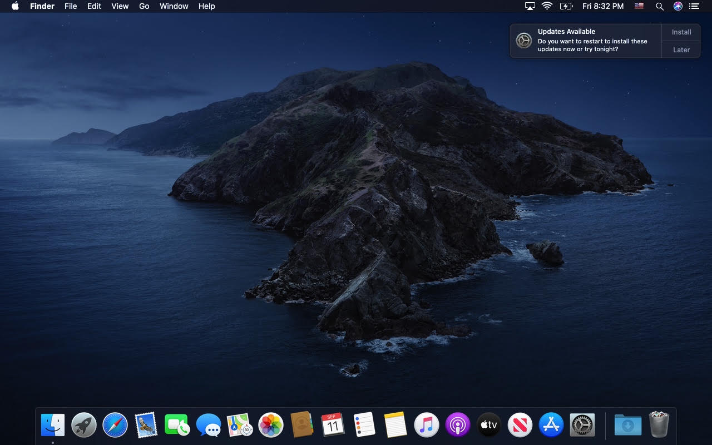
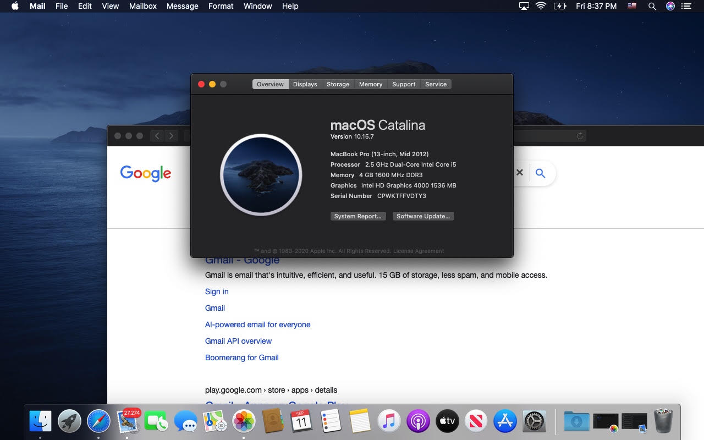
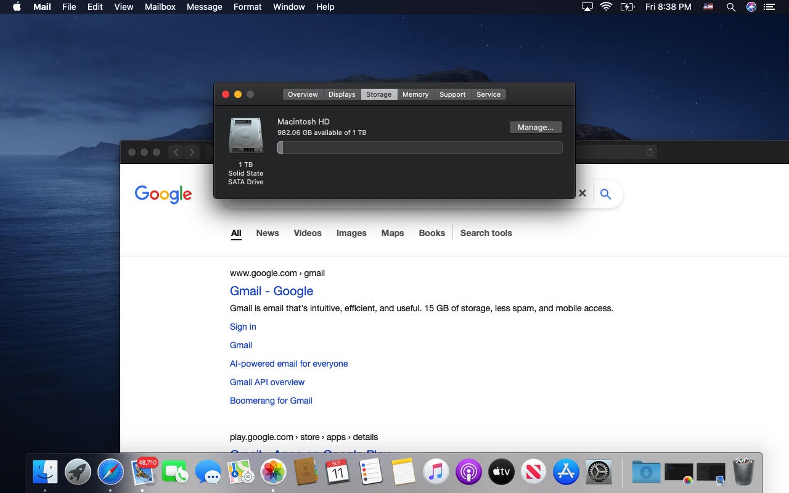
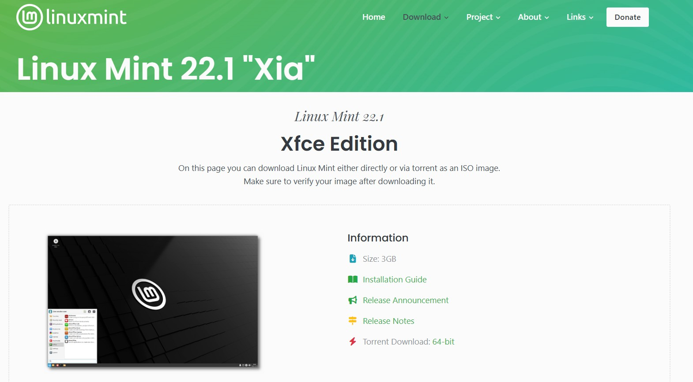
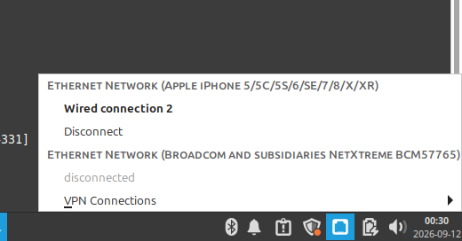

# Converting an Old MacBook to Linux Mint XFCE

Process of wiping macOS from an older Macbook and migrating the system to Linux Mint XFCE.

## Overview
I started this project because I wanted to gain hands-on experience with Linux and learn how to work with an operating system outside of Windows.

After doing some research, I decided to use Linux Mint because it's known for being beginner-friendly and has a familiar desktop environment.

I chose the Xfce edition of Linux Mint because of the hardware limitations of the MacBook I was using. The MacBook only has 4 GB of RAM, so I wanted to use a lightweight environment that would be better suited to the available hardware.

The MacBook's RAM is soldered directly to the motherboard, meaning it can't be upgraded through a traditional RAM replacement. This means I have to work with the system's existing 4 GB of RAM.

The goal of this project was to repurpose an older MacBook into a functional Linux system that could be used for my IT studies and learning Linux system administration.

## Hardware
- MacBook model: MacBook Pro (13-inch, Mid 2012) 
- CPU: 2.5 GHz Dual-Core Intel Core i5
- RAM: 4 GB 1600 MHz DDR3
- Storage: 1 TB SATA SSD
- GPU: Intel HD Graphics 4000
- Original OS: macOS Catalina 10.15.7

## Objectives
- Replace the original macOS installation
- Create bootable Linux Mint installation media
- Prepare the Mac's internal storage
- Install Linux Mint
- Verify hardware and network functionality

## Starting Point
This MacBook originally had no usable operating system and displayed a flashing folder icon when attempting to boot.

I used Apple's Internet Recovery environment to restore macOS Catalina before beginning the Linux conversion. This gave me a clean starting point for documenting the transition from macOS to Linux.

### macOS Recovery
Internet Recovery was accessed using:

```text
Option + Command + R (held while MacBook was turning on)
```

After connecting to Wi-Fi, the MacBook successfully loaded the macOS Utilities environment.

I selected **Reinstall macOS** and installed macOS Catalina.



### Original System Information

After restoring macOS, I used **About This Mac** to document the original
hardware.



The MacBook contained a 1 TB SATA solid-state drive.



# Installation Process

## 1. Downloading Linux Mint

I downloaded the 64-bit Xfce edition of Linux Mint 22.1 "Xia" from the
official Linux Mint website.



I chose Xfce because the MacBook only has 4 GB of RAM and a lightweight
desktop environment is better suited to the system's hardware limitations.

The Linux Mint ISO was downloaded to a Windows computer before creating
the installation media.

---

## 2. Creating the Bootable USB

I used Rufus on Windows to write the Linux Mint ISO to a 64 GB USB drive.

.jpg)

Before using Rufus, I made sure that there was no important data on the
USB drive because the process would erase the existing contents.

Rufus displayed a warning that all data on the selected USB device would
be destroyed.

.jpg)

I confirmed the operation and allowed Rufus to write the Linux Mint ISO
to the USB drive.

### Windows Security

During the USB creation process, Windows Defender's real-time protection
interfered with writing the Linux installation files to the USB drive.

I temporarily disabled real-time protection so the USB creation process
could be completed.

After the Linux Mint installation media was created, I removed the USB
drive and re-enabled Windows Defender's real-time protection.

> **Note:** Security protections should only be disabled when necessary
> and should be re-enabled as soon as the task is complete.

---

## 3. Booting the MacBook from the USB

After creating the bootable USB, I connected it to the MacBook and restarted
the system.

I held the **Option (⌥)** key during startup to access the Mac's Startup
Manager and selected the Linux Mint USB.

---

## 4. Installing Linux Mint XFCE

I booted into the Linux Mint installation environment and began the
installation process.

The internal MacBook drive was selected as the installation target,
replacing the existing macOS installation.

> **Warning:** Selecting an option that erases the disk permanently
> removes the existing operating system and data from that drive.
> Always verify the correct disk before proceeding.

After the installation completed, the MacBook successfully booted into
Linux Mint XFCE.

---

## Challenges / Troubleshooting
## Wi-Fi Not Detected

After installing Linux Mint, the MacBook's built-in Wi-Fi was not initially
available.

Since the MacBook didn't have working Wi-Fi, I needed another way to provide Internet access so that I could download the required firmware.

I used **USB tethering through my iPhone's personal hotspot** to temporarily provide the MacBook with an Internet connection.



Once Internet access was established, I investigated the system's network hardware using:

```bash
lspci -nnk | grep -A3 -i network

```

.png)

This identified the wireless adapter as:

```text
Broadcom BCM4331 802.11a/b/g/n
```

The adapter was detected, but the required firmware wasn't installed.

---

## Installing the Broadcom Firmware

With Internet access provided through USB tethering, I installed the required firmware package using `apt`:

```bash
sudo apt install firmware-b43-installer
```

.png)

After installing the firmware, I rebooted the system:

```bash
sudo reboot
```

---

## Verifying Wi-Fi

After rebooting, the wireless adapter was available and nearby networks
were displayed.

I successfully connected the MacBook to Wi-Fi.

This confirmed that the missing wireless firmware had been successfully
resolved.

---

# Hardware Verification

After completing the installation and troubleshooting, I used `inxi` to
verify the hardware from within Linux Mint.

I installed `inxi` using:

```bash
sudo apt install inxi
```

Then I used:

```bash
inxi -Fxz
```

The command identified the system as:

```text
Apple MacBookPro9,2
```

It also detected:

- Intel Core i5-3210M
- 4 GB RAM
- Intel HD Graphics 4000
- Approximately 931 GB of storage
- Broadcom BCM4331 wireless adapter

The Linux hardware information matched the specifications previously
recorded from macOS.

---

## What I Learned
This project gave me hands-on experience with:

- Linux installation and recovery
- Creating bootable USB installation media
- Operating system replacement
- Disk and partition management
- Linux hardware identification
- Package and firmware management
- Driver troubleshooting
- Using USB tethering to provide temporary Internet access when Wi-Fi is unavailable
- Using command-line hardware diagnostic tools
- Basic Linux system administration
- Working with older hardware and hardware limitations

One of the most useful parts of the project was troubleshooting the Wi-Fi
adapter. Instead of accepting that the hardware did not work, I
used Linux command-line tools to identify the wireless adapter, determined
that the required firmware was missing, installed the appropriate package,
and verified that the adapter worked afterward.

---

## Result
The old MacBook Pro was successfully converted from macOS Catalina to
Linux Mint 22.1 Xfce.

The finished system successfully boots into Linux Mint, recognizes its
hardware, and connects to Wi-Fi.

The repurposed MacBook can now be used as a lightweight system for Linux
practice, IT study, networking labs, and further experimentation.
